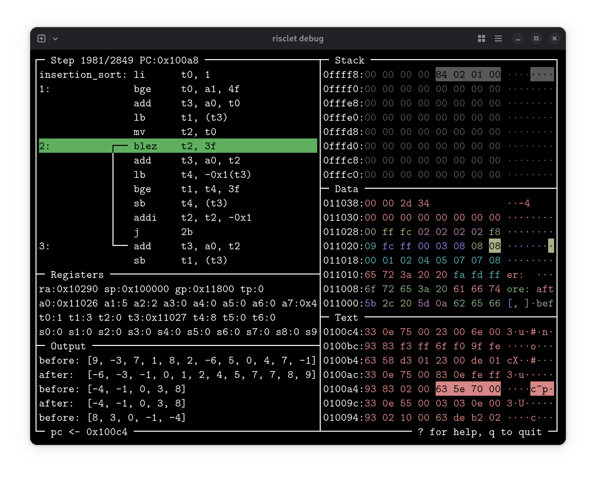

risclet
=======

This is a lightweight RISC-V assembler, disassembler, simulator, debugger, and linter for students learning assembly language. It has few controls and deliberately limited functionality, with simplicity and approachability as overriding goals. It is designed to be the only tool a student needs to install for the assembly language portion of a course.

Try it out: [live demo](https://russross.github.io/risclet/)

Running risclet
---------------

To assemble and run a program:

    risclet

This assembles and links all `*.s` files in the current directory in memory, or loads `a.out` if no assembly files are present, then runs the program and exits. Optional arguments select specific assembly files or an executable.

In addition:

*   `risclet run`: same as plain `risclet`
*   `risclet trace`: run the program, displaying each disassembled instruction and its side effects as it goes
*   `risclet assemble`: assemble source and write an executable (`a.out` by default)
*   `risclet disassemble`: print the program's disassembly
*   `risclet debug`: run the program to completion, then enter a TUI to step back and forth through execution and examine its effects

Add `--strict` to `run`, `trace`, or `debug` to check for calling-convention violations and common beginner mistakes, treating them as errors. Use `risclet <command> --help` for other options.

All commands use the same input defaults, except `assemble` requires source files. For example, `risclet disassemble` assembles and links `*.s` files in the current directory before disassembling the result.

The debugger
------------

`risclet debug` runs the program first, including all input/output, and records each instruction's effects. It then opens a terminal interface for stepping and jumping forward and backward through the recorded execution. An 80×24 or larger terminal is recommended.

The debugger displays disassembly, registers, input/output, and the stack, data, and text segments. It previews the next instruction's effects and draws taken branches. Colors distinguish stack frames, labeled data, and functions; highlights mark recent memory accesses and the current instruction.

Press `?` to display the controls:

*   Scroll the cursor through the source using Up, Down, PgUp, and PgDown
*   Step forward/backward using Right, Left
*   Jump to beginning/end of current function using Home, End
*   Jump forward/backward to current cursor position using Enter, Backspace
*   Various toggles to control what is displayed

Features
--------

*   Support for RV32 integer instructions and the M, A, and C extensions (rv32imac)
*   Optional checks for ABI register use, function structure, and stack usage
*   Minimal controls, no breakpoints or watch expressions
*   System calls for reading stdin, writing stdout, and exiting
*   Portable Rust implementation with one direct crate dependency (crossterm for the TUI)
*   Single-file binaries for Linux and macOS in [GitHub releases](https://github.com/russross/risclet/releases); Linux binaries are statically linked

More details
------------

[Assembly language reference](SYNTAX.md)

[How the assembler works](ASSEMBLER.md)

Editor syntax highlighting
--------------------------

Syntax definitions follow the language implemented by the assembler:

*   [CodeMirror 6](syntaxhighlighting/codemirror/README.md)
*   [Vim](syntaxhighlighting/vim/README.md)
*   [VS Code](syntaxhighlighting/vscode/README.md)
*   [Micro](syntaxhighlighting/micro/README.md)

Contributors
------------

This tool is designed for small programs written by hand. Minimal features and simple controls are explicit goals. I am reluctant to accept features that work against those goals. Bug reports and fixes are welcome.

*   [Russ Ross](https://github.com/russross)
